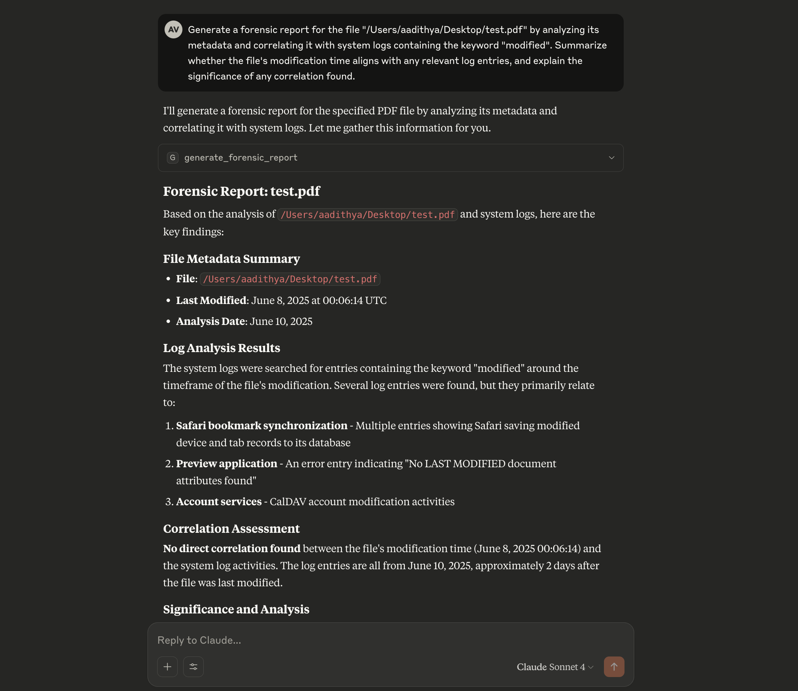

# MCP Forensic Toolkit

**MCP Forensic Toolkit** is a secure, AI-ready local server for digital forensics, built using the [Model Context Protocol (MCP)](https://github.com/modelcontextprotocol). It exposes semantically meaningful tools to analyze logs, verify file integrity, and generate audit-grade forensic reports. Designed for analysts and LLMs alike, it enables automated investigation with precision and safety.

---

## Features

* Structured log triage using keyword-based scanning (`scan_syslog`)
* File metadata extraction and SHA-256 hashing (`file_metadata`)
* Recursive integrity scanning with directory hashing (`hash_directory`)
* Correlation engine linking file modifications to log events (`correlate_file_and_logs`)
* Human-readable forensic reporting (`generate_forensic_report`)
* Secure access control via `SAFE_BASE` and sandboxed environment
* Built-in LLM prompts for guided reasoning and forensic tasks

---

## Screenshot

This example demonstrates a successful correlation analysis between a file and system log entries using the `generate_forensic_report` tool:



---

## Getting Started

### Prerequisites

* Python 3.10+
* Poetry or pip
* MCP CLI (`pip install modelcontext` or follow setup guide)
* `.env` file with `SAFE_BASE` defined

---

## Installation

```bash
# Clone the repo
git clone https://github.com/axdithyaxo/mcp-forensic-toolkit.git
cd mcp-forensic-toolkit

# Create and activate a virtual environment
python -m venv .venv
source .venv/bin/activate

# Install dependencies
pip install -r requirements.txt

# Create and configure environment
cp .env.example .env
# Edit .env and set your SAFE_BASE (e.g. /Users/yourname/Desktop)
```

---

## Usage

### Start the Server

```bash
mcp dev server.py
```

`server.py` is the entry point and defines all MCP tools, prompts, and resources.

---

### Access via MCP Inspector

Use the MCP Inspector or visit:

```
http://127.0.0.1:6274
```

You can then:

* Run tools (`scan_syslog`, `file_metadata`, etc.)
* Execute prompts for analysis
* View and inspect structured output

---

## CLI Demo (Optional)

You can run a command-line demo as follows:

```bash
python cli_demo.py ~/Desktop/test_hit.txt correlation
```

If correlation is found, output includes:

```text
File: /Users/...
Keyword searched in logs: 'correlation'
File modified at: ...
Matching log entries:
  - ...
  - ...
Correlation found: Yes
```

Otherwise:

```text
Correlation found: No
```

---

## Example Workflow

1. Modify or inspect a file within `SAFE_BASE`.
2. Run `generate_forensic_report` or the CLI tool.
3. Use MCP Inspector or LLM to interpret results.
4. Example match:

```json
{
  "filename": "/Users/you/Desktop/test_hit.txt",
  "file_modified_time": "2025-06-08T00:26:04.714230",
  "log_hits": [
    "logger: correlation test for test_hit.txt",
    "log run noninteractively, args: ..."
  ],
  "correlation_found": true
}
```

---

## Environment Variables

| Variable    | Description                                 |
| ----------- | ------------------------------------------- |
| `SAFE_BASE` | Restricts all file operations to this path. |

Example `.env.example`:

```dotenv
SAFE_BASE=/Users/yourname/Desktop
```

---

## Security Considerations

* All tools validate paths against `SAFE_BASE`
* System logs are accessed in a read-only way
* Tools gracefully handle permission errors and malformed inputs
* CLI interface avoids unsafe globbing or directory traversal

---

## Testing

Run unit tests:

```bash
python test_server.py
```

Or with pytest:

```bash
pytest test_server.py -v
```

---

## Usage Examples

### Example: "Investigate File" Prompt in Claude Desktop
**Prompt Given**

Use the investigate-file prompt to analyze the file at "/Users/username/Desktop/test_hit.txt".
Provide the file size, creation and modification times, and SHA-256 hash.
Assess if there are any signs of tampering or suspicious characteristics.

**Example Response**

## File Investigation Report

### Basic File Information
- File Path: /Users/username/Desktop/test_hit.txt
- File Size: 9 bytes
- Created: June 8, 2025 at 00:26:04.733792 UTC
- Modified: June 8, 2025 at 00:26:04.714230 UTC
- SHA-256 Hash: 9b7729b1ccfe223076659db07b7f0bb888e139907bb8d7019560166176953fcb

### Analysis and Assessment

File Characteristics:
- This is a very small file (only 9 bytes), likely containing minimal text content
- The file was created and modified almost simultaneously, with the modification timestamp actually preceding the creation timestamp by about 19 milliseconds - this is unusual but can occur due to filesystem timing precision differences

Temporal Analysis:
- Creation and modification occurred at 00:26:04 UTC
- No specific log entries were found relating to this file’s creation or modification in the system logs
- The logs show normal system activity around that time period, primarily power management and Claude desktop application activity

Security Assessment:

There are no apparent signs of tampering or suspicious characteristics:

1. File Size: The 9-byte size is consistent with a small text file  
2. Timestamps: While the modification time slightly precedes creation time, this is a known filesystem behavior and not indicative of tampering  
3. Hash Integrity: The SHA-256 hash provides a baseline for future integrity verification  
4. System Logs: No suspicious file system activity or security events were detected around the creation time  
5. Location: The file is in a standard user Desktop directory, which is a normal location for user files

Recommendations:
- The file appears to be legitimate with no signs of tampering  
- Store the SHA-256 hash for future integrity verification  
- Monitor for any unexpected changes by periodically checking its hash

### Additional Example Prompts

**1. Triage System Logs Prompt**

Use the triage-system-logs prompt to search the system logs for the keyword “error”.
Summarize the most relevant log entries indicating warnings or security events.
Advise if any immediate action is recommended.

**2. Correlate Log and File Prompt**

Use the correlate-log-and-file prompt to analyze the file “/Users/username/Desktop/test_hit.txt” and search system logs for the keyword “correlation”.
Determine if the file modification times align with suspicious log events.
Explain the correlation and its forensic implications.

**3. Explain Correlation Prompt**

Use the explain-correlation prompt with the file “/Users/username/Desktop/test_hit.txt” and keyword “correlation”.
Interpret the log hits and file metadata.
Provide a concise forensic reasoning summary (under 100 words).

## Forensic Analysis Report

A detailed forensic analysis report demonstrating usage and output of the toolkit is available:

- [Forensic Analysis Report (Markdown)](docs/forensic_analysis_report.md)

This report provides an example of the kind of structured output generated by the toolkit’s tools and prompts.

## License

MIT License

---

## Acknowledgments

* The Model Context Protocol (MCP) team and community for creating an innovative standard enabling interoperable AI tool integration.
* The FastMCP Python SDK developers for providing a robust and user-friendly framework to build MCP servers.
* The broader open-source and digital forensics communities for inspiring secure and effective AI-driven investigative tooling.
* Projects and initiatives focused on secure AI-agent interfacing and infrastructure automation, which shaped the vision behind this toolkit.

